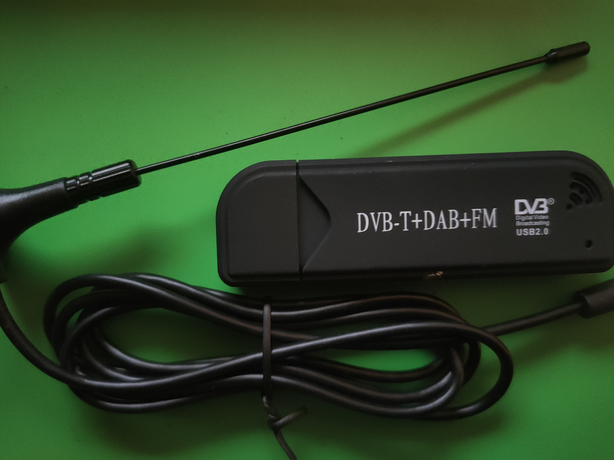
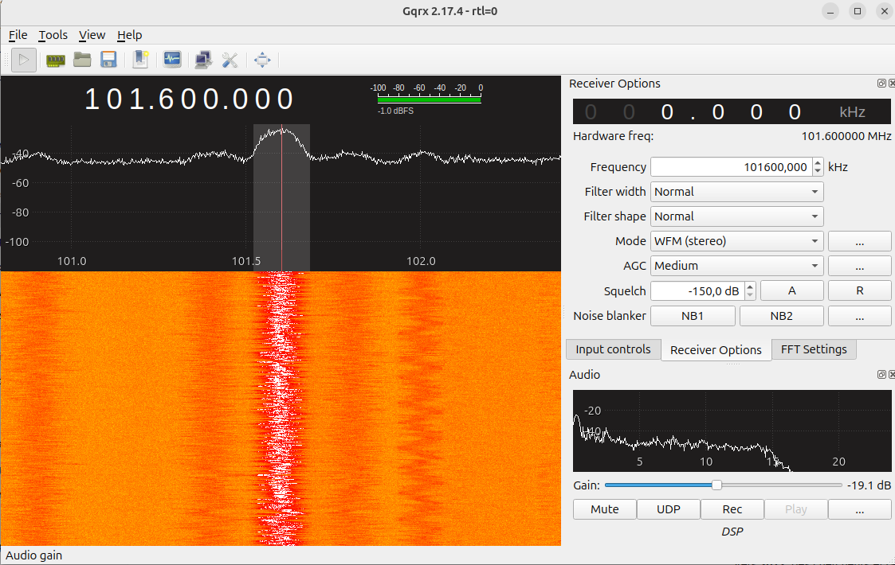

# Méthodologie et matériel utilisé

L'objectif de ce livre n'est pas seulement de présenter des concepts théoriques, mais aussi de montrer **comment expérimenter concrètement les technologies radio et télécom**.

Pour cela, l'ensemble des expérimentations décrites dans ce livre a été réalisé avec un **ordinateur personnel sous Linux** et des outils **open-source** largement disponibles.

L'environnement utilisé est volontairement simple afin de permettre à toute personne intéressée de **reproduire les expériences**.

## Configuration matérielle

Les expérimentations ont été réalisées sur un **ordinateur portable classique**.

Configuration utilisée :

- **Ordinateur** : PC portable
- **Système d'exploitation** : Ubuntu 24.04 LTS
- **Processeur** : architecture x86-64
- **Interface radio** : SDR (Software Defined Radio)
- **Antenne** : antenne large bande adaptée aux fréquences étudiées

Les outils utilisés dans ce livre reposent principalement sur :

- **logiciels open-source**
- **outils de traitement du signal**
- **outils d'analyse réseau**

Cette approche permet d'éviter l'utilisation d'équipements propriétaires coûteux souvent utilisés dans l'industrie des télécommunications.

## Installation d'Ubuntu 24.04 à partir de Windows

De nombreux lecteurs utilisent initialement **Windows**.  
La première étape consiste donc à installer **Ubuntu Linux**, qui offre un environnement particulièrement adapté à l'expérimentation réseau et radio.

### 1. Télécharger Ubuntu

Télécharger l'image officielle :

https://ubuntu.com/download

Choisir :

**Ubuntu 24.04 LTS**

Le fichier téléchargé est une image **ISO** du système.

### 2. Créer une clé USB bootable

Sous Windows, utiliser un outil comme :

- **Rufus**
- **Balena Etcher**

Procédure :

- insérer une **clé USB (8 Go minimum)**
- sélectionner l'image **ISO Ubuntu**
- créer la **clé bootable**

### 3. Démarrer sur la clé USB

Redémarrer l'ordinateur et accéder au **menu de démarrage** (souvent avec une touche comme `F12`, `F10` ou `ESC`).

Sélectionner :

**Boot sur la clé USB**

### 4. Installer Ubuntu

L'installateur Ubuntu guide ensuite l'utilisateur.

Les options recommandées :

- installation complète
- téléchargement des mises à jour pendant l'installation
- installation des pilotes supplémentaires

Deux options sont possibles :

- **Dual boot** (Windows + Ubuntu)
- **Ubuntu seul**

Pour les expérimentations décrites dans ce livre, un système **Ubuntu seul** simplifie généralement la configuration.

### 5. Mise à jour du système

Une fois Ubuntu installé, ouvrir un terminal et exécuter :

```bash
sudo apt update
sudo apt upgrade
```

Cela garantit que le système est à jour avant l'installation des outils nécessaires.

Pourquoi utiliser Linux ?

La plupart des outils radio et télécom utilisés dans ce livre ont été développés pour Linux.

Linux offre plusieurs avantages :

- accès direct au matériel

- outils réseau avancés

- environnement de développement complet

- écosystème open-source riche

C'est pour cette raison que Linux est aujourd'hui le système le plus utilisé dans la recherche en télécommunications et en sécurité radio.

## La clé RTL-SDR



L'un des outils les plus accessibles pour explorer le spectre radio est la **clé RTL-SDR**.

À l'origine, ces dispositifs étaient conçus comme de simples **récepteurs de télévision numérique DVB-T**.  
Cependant, il a été découvert que la puce utilisée dans ces récepteurs permettait d'accéder directement au **flux brut du signal radio**.

Grâce à un pilote modifié, ces clés peuvent être utilisées comme **récepteurs radio généralistes à très bas coût**.

Une clé RTL-SDR typique se compose de :

- **Un tuner radio**  
  souvent basé sur la puce **R820T ou R860**.

- **Un convertisseur analogique-numérique**  
  intégré dans la puce **RTL2832U**.

- **Une interface USB**  
  permettant de connecter l'appareil à un ordinateur.

La clé fonctionne alors comme un **récepteur SDR (Software Defined Radio)**.

Le principe est le suivant :

$$
\text{Onde radio} \rightarrow \text{antenne} \rightarrow \text{tuner RF} \rightarrow \text{ADC} \rightarrow \text{USB} \rightarrow \text{logiciel}
$$

La plage de fréquences typique couverte par ces clés est :

$$
24\;MHz \rightarrow 1.7\;GHz
$$

Cela permet d'observer de nombreux systèmes radio :

- radio **FM**
- **aviation**
- **satellites météo**
- **AIS maritime**
- **ADS-B aviation**
- certains signaux **cellulaires**

Ces clés coûtent généralement **moins de 40 €**, ce qui a largement contribué à démocratiser l'expérimentation radio.

---

# Installation des outils RTL-SDR sous Ubuntu

La première étape consiste à installer les pilotes permettant d'accéder au matériel.

Ouvrir un terminal :

```bash
sudo apt install rtl-sdr
```

Voici une version **plus propre et fluide** que tu peux intégrer dans ton livre.

## Configuration des permissions RTL-SDR

Pour permettre à un utilisateur normal d’accéder à la clé RTL-SDR sans utiliser `sudo`, il est nécessaire d’ajouter une règle **udev**.

La méthode la plus simple consiste à utiliser un **here-document** en Bash.  
Cette technique permet d’écrire directement le contenu du fichier avec les droits administrateur.

Exécuter la commande suivante :

```bash
sudo tee /etc/udev/rules.d/20-rtl-sdr.rules > /dev/null << 'EOF'
SUBSYSTEM=="usb", ATTRS{idVendor}=="0bda", ATTRS{idProduct}=="2832", GROUP="plugdev", MODE="0666"
SUBSYSTEM=="usb", ATTRS{idVendor}=="0bda", ATTRS{idProduct}=="2838", GROUP="plugdev", MODE="0666"
EOF
````

Cette règle donne aux membres du groupe **plugdev** l'accès au périphérique RTL-SDR.

---

## Recharger les règles udev

Une fois la règle créée, il faut demander au système de recharger la configuration :

```bash
sudo udevadm control --reload-rules
sudo udevadm trigger
```

Ensuite, **débrancher puis rebrancher la clé RTL-SDR** pour que la règle soit appliquée.

---

## Vérifier que la clé fonctionne

Pour vérifier que le système détecte correctement la clé, utiliser l’outil de test fourni avec les pilotes :

```bash
rtl_test
```

Si tout est correctement configuré, le programme devrait afficher quelque chose comme :

```text
Found 1 device(s):
Realtek RTL2838UHIDIR
```

Cela indique que la clé est correctement reconnue par le système et prête à être utilisée par les logiciels SDR.


## Vérifier que la clé est détectée

Brancher la clé USB puis exécuter :

```bash
rtl_test
```

Si l'installation fonctionne, le programme affiche quelque chose comme :

```
Found 1 device(s):
Realtek RTL2838UHIDIR
```

Le programme commence ensuite à tester la réception du signal.

Pour arrêter le test :

```
CTRL + C
```

Si ce message apparaît, la clé est correctement reconnue par le système.

---

# Installation de GQRX

Pour visualiser les signaux radio, on utilise un logiciel appelé **GQRX**.

GQRX est une interface graphique permettant de :

* observer le **spectre radio**
* syntoniser une **fréquence**
* écouter les **signaux analogiques**
* analyser les transmissions

Installer GQRX avec :

```bash
sudo apt install gqrx-sdr
```

---

# Lancer GQRX

Démarrer le programme :

```bash
gqrx
```

Lors du premier lancement, une fenêtre de configuration apparaît.

Paramètres recommandés :

* **Device** : RTL-SDR
* **Sample rate** : 2.4 MS/s
* **Input rate** : automatique

Cliquer sur **Start DSP**.

Le logiciel affiche alors :

* un **spectre radio**
* une **cascade (waterfall)** des signaux reçus

Chaque pic visible dans le spectre correspond à **une transmission radio**.

---


3. ajuster le **gain** si nécessaire

Si une station radio est présente, vous devriez **entendre la musique** immédiatement.

Cette expérience simple montre un point essentiel :

**le spectre radio est rempli de signaux invisibles que l'on peut observer avec une simple clé SDR et un ordinateur.**

Dans les chapitres suivants, nous utiliserons ces outils pour **explorer différents systèmes radio et protocoles de communication**.

la **clé RTL-SDR** est un accident technologique fascinant.

Les ingénieurs de Realtek n'ont jamais prévu que cette puce devienne un **instrument scientifique mondial**.  

Mais en exposant le **flux I/Q brut**, ils ont créé sans le vouloir l’un des outils les plus utilisés pour :

- la **radio amateur**
- la **recherche en télécom**
- l’**analyse de protocoles radio**
- la **sécurité sans fil**

Un détail intéressant de l’histoire de ces clés est qu’elles **n’étaient pas conçues à l’origine pour être des récepteurs SDR**.

Le circuit **RTL2832U**, fabriqué par Realtek, était destiné aux récepteurs **DVB-T (télévision numérique)**.
Cependant, les ingénieurs avaient laissé accessible un **mode interne permettant de récupérer le flux IQ brut** utilisé pour la démodulation.

Vers **2012**, des chercheurs et radioamateurs ont découvert ce mode et ont développé des pilotes permettant d’y accéder.

Cette découverte a transformé un simple récepteur TV à bas coût en **récepteur radio large bande programmable**, ouvrant la porte à une démocratisation massive de l’expérimentation radio.

Aujourd’hui, une clé RTL-SDR coûtant quelques dizaines d’euros permet d’explorer un spectre radio qui nécessitait autrefois **des analyseurs de spectre professionnels coûtant plusieurs dizaines de milliers d’euros**.

# Première expérience : écouter la radio FM

Pour tester la réception :

1. régler la fréquence autour de

```
100 MHz
```

2. choisir le mode :

```
WFM (Wide FM)
```


